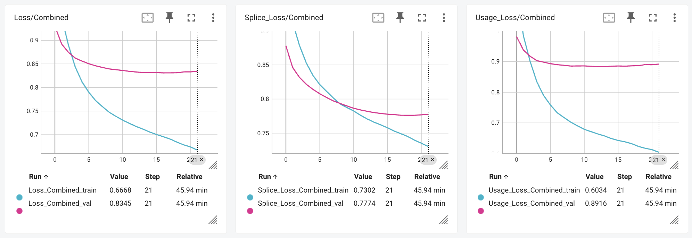
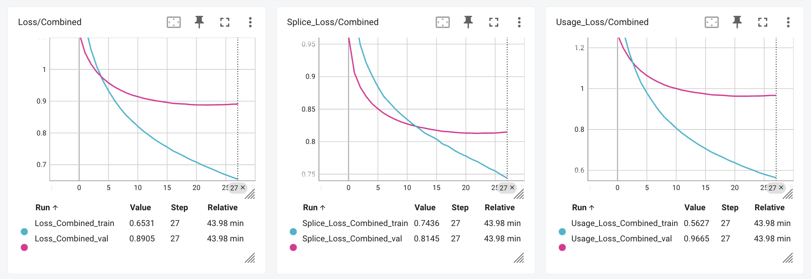

# SplicEvo

## Architecture Overview

The model architecture consists of an encoder module that processes the input sequence through a series of residual blocks with varying dilation rates, allowing the network to learn features at multiple scales. This is followed by a transformer module that captures long-range dependencies through self-attention mechanisms. The combination of these two architectures enables the model to effectively learn complex patterns in the data.

### EncoderModule

The `EncoderModule` class constructs an encoder with a series of residual blocks (`ResBlock`) with two dilated 1D convolutional layers and batch normalization. 

### ResBlock

ResBlock implements a residual block with two convolutional layers, each followed by batch normalization and ReLU activation. The first convolution uses a dilation rate specified by the given dilation strategy, while the second uses a fixed dilation of 1. A residual connection adds the input to the output of the second convolution before applying a final ReLU activation.

### Dilation Strategy

The dilation strategy determines the dilation rates used in the first convolutional layer of the residual blocks. Dilation, together with kernel size, determines the effective receptive field of the convolutional layer. Splicevo implements several possible  dilation strategies that allow each `ResBlock` to potentially use different dilation rates in the first convolutional layer. This allows the model to capture features at multiple scales. 

To train a model, I re-use parameters from from SpliceTransformer: fixed kernel size 9 (for capturing relevant sequence motifs) and alternating increasing dilation rates in 16 stacked `ResBlock`s to capture long-range dependencies effectively.

```
from splicevo.model import EncoderModule
encoder = EncoderModule(
    num_resblocks=16,
    dilation_strategy='alternating',
    alternate=4
)
encoder.dilations
# [1, 1, 1, 1, 4, 4, 4, 4, 10, 10, 10, 10, 20, 20, 20, 20]
encoder.kernel_sizes
# [9, 9, 9, 9, 9, 9, 9, 9, 9, 9, 9, 9, 9, 9, 9, 9]
```

With kernel size $k$ and dilation $d$, the effective receptive field is $d \times (k - 1) + 1$. We use $k=9$ and $d \in [1, 20]$, resulting in receptive fields from 9 to 169 positions.

#### Pre- vs Post-activation

The original ResNet design implements activation following convolution, i.e. post-activation pattern (Conv → BatchNorm → ReLU). Instead, here I use pre-activation (BatchNorm → ReLU → Conv), as in SpliceTransformer. This can lead to better gradient flow and may improve training stability.


```python
Input (batch, channels, seq_len)
    ↓
Conv1d(kernel=9, dilation=d)
    ↓
Batch Normalization
    ↓
ReLU activation
    ↓
Conv1d(kernel=3, dilation=1)
    ↓
Batch Normalization
    ↓
Add residual connection
    ↓
ReLU activation
    ↓
Output (batch, channels, seq_len)
```

I  tested the two approaches on the small subset of data for splicing prediction.

Pre-activation:  


Post-activation:  


On the small subset of data, the difference is marginal, but the pre-activation seems to have a slight edge in convergence speed and final loss.
